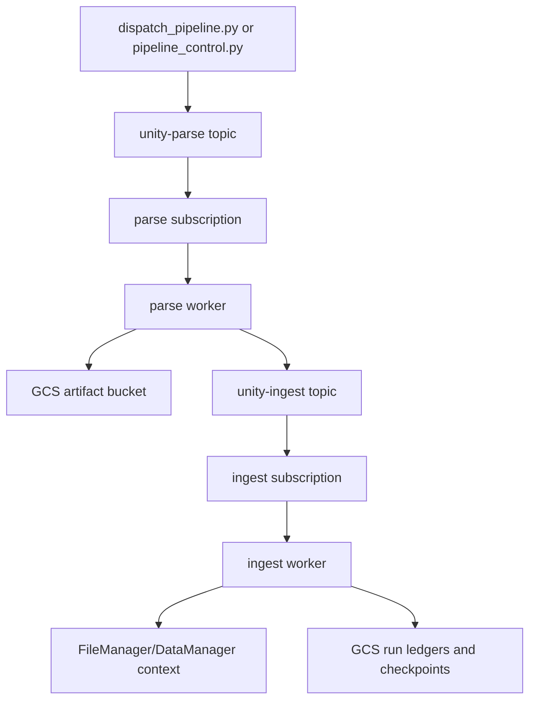

# Pipeline Operations And Debugging Guide

This is the operator-facing guide for the Unity parse + ingest pipeline:
resource layout, dispatch/monitoring tools, rollout paths, live infra
reconciliation, and incident triage.

Use this when running an ad-hoc ingestion, rolling worker changes, checking
prod/staging parity, or debugging a stuck Pub/Sub backlog.

## Environment Map

Pipeline resources are environment-qualified. Production is unsuffixed;
staging uses `-staging`.

| Resource | Production | Staging |
| --- | --- | --- |
| Namespace | `production` | `staging` |
| Worker image | `unity:latest` | `unity-staging:latest` |
| Artifact bucket | `gs://bucket` | `gs://bucket` |
| Parse topic | `unity-parse` | `unity-parse-staging` |
| Ingest topic | `unity-ingest` | `unity-ingest-staging` |
| Parse subscription | `unity-parse-sub` | `unity-parse-sub-staging` |
| Ingest subscription | `unity-ingest-sub` | `unity-ingest-sub-staging` |
| DLQ subscription | `unity-dead-letter-sub` | `unity-dead-letter-sub-staging` |

These settings should stay identical across production and staging:

- parse/ingest subscription ack deadline: `120s`
- GCS lifecycle policy from `deploy/k8s/workers/gcs-lifecycle-rules.json`
- worker ephemeral-storage request and limit: `4Gi`
- failed-pod GC behavior for `Failed` and `Unknown` pipeline-worker pods
- log/debug script semantics

Intentional differences are limited to names, image tags, Orchestra URL,
bucket/subscription suffixes, HPA capacity, and resource limits.

## Data Flow

The pipeline is driven by Pub/Sub messages and GCS artifacts:



Parse messages tell a parse worker to download source files, parse them,
materialize pointer-backed `IngestPlan` manifests and row artifacts into
GCS, and publish ingest messages. Ingest messages carry a manifest key and
binding metadata; ingest workers stream rows into either FileManager or
DataManager depending on `ingestion_mode`.

Operationally, dispatches are normally one source file per parse message,
which lets HPA scale workers by Pub/Sub backlog.

## Source Of Truth

Repo files own the desired state:

- worker deployments, HPAs and PDBs: `deploy/k8s/workers/*worker-deployment*.yaml`
- weekly rollout CronJob: `deploy/k8s/workers/workers-weekly-rollout-cronjob.yaml`
- failed/unknown pod cleanup: `deploy/k8s/workers/failed-pod-gc-cronjob.yaml`
- GCS lifecycle: `deploy/k8s/workers/gcs-lifecycle-rules.json`
- bootstrap defaults: `deploy/scripts/dev/setup_pipeline_infra.sh`
- monitor/drain tooling: `deploy/scripts/dev/run_pipeline.sh`, `deploy/scripts/dev/drain_dlq.sh`

Live GCP/GKE only changes after those files are applied by Cloud Build or
explicit operator commands.

## Running And Monitoring

Dispatch and monitor through the environment-aware wrapper:

```bash
# Dispatch and stream logs.
deploy/scripts/dev/run_pipeline.sh --env staging \
  --mode dm \
  --config path/to/pipeline_config.json \
  --project-root "$PWD" \
  --user-id "$USER_ID" \
  --assistant-id "$ASSISTANT_ID"

# Attach to an already-running environment.
deploy/scripts/dev/run_pipeline.sh --monitor --env staging
deploy/scripts/dev/run_pipeline.sh --monitor --env production
```

The script prints the resolved namespace, bucket, project, parse/ingest
subscriptions, and DLQ subscription before it starts. Logs go under
`logs/pipeline/<timestamp>/`:

- `dispatch.log`
- `parse-worker.log`
- `ingest-worker.log`
- `hpa.log`
- `pods.log`
- `pubsub-backlog.log`
- `dlq.log`

The log streams use `kubectl logs --since-time` plus exact-line dedup, so
reconnects should not replay old `Completed job=` lines.

## Operator CLIs

For config-driven submits:

```bash
python -m unity_deploy.infra.cli.pipeline_control submit \
  --config path/to/pipeline_config.json \
  --project Assistants

python -m unity_deploy.infra.cli.pipeline_control monitor \
  --job-id "$JOB_ID" --follow

python -m unity_deploy.infra.cli.pipeline_control cancel \
  --job-id "$JOB_ID"

python -m unity_deploy.infra.cli.pipeline_control inspect \
  --job-id "$JOB_ID"
```

For direct dispatch tests:

```bash
uv run unity_deploy/scripts/dispatch_pipeline.py \
  --mode dm \
  --files-from ./files.txt \
  --target-context "SalesData"
```

`--file` accepts either a local path, which is uploaded to the artifact
bucket, or a `gs://` URI, which is dispatched directly.

## Backlog Metrics

Prefer absolute Cloud Monitoring metrics over HPA output. `run_pipeline.sh`
writes absolute values to `pubsub-backlog.log`:

```text
12:00:00  parse: undeliv=0 oldest=0s replicas=1/1  |  ingest: undeliv=25 oldest=6589s replicas=15/15
```

Older logs may show values such as `1667m`. That is the HPA external
metric `averageValue`, not total backlog: `1667m` means roughly 1.667
messages per replica. Multiply by current replicas to estimate the real
queue depth.

Both production and staging parse/ingest subscriptions should use a 120s
initial ack deadline:

```bash
gcloud pubsub subscriptions update unity-ingest-sub-staging --ack-deadline=120
gcloud pubsub subscriptions update unity-parse-sub-staging --ack-deadline=120
gcloud pubsub subscriptions update unity-ingest-sub --ack-deadline=120
gcloud pubsub subscriptions update unity-parse-sub --ack-deadline=120
```

Long messages are protected by `LeaseController`, which extends by 300s
every 120s from a daemon thread. A dead pod should therefore sit in limbo
for about two minutes, not ten.

## GCS Artifact Buckets

Everything for a run lives under `jobs/<run_id>/` in the environment's
bucket. The environment boundary is the bucket name, not a key prefix, so
staging cannot cross-write into production by construction.

Typical run layout:

```text
gs://bucket{env_suffix}/
  jobs/{run_id}/
    source/<basename>
    manifests/<stem>.json
    artifacts/*.jsonl
    run_ledger.jsonl
    heartbeats.jsonl
    cost_ledger.json
```

The repo lifecycle file is the source of truth for both buckets:

```bash
gsutil lifecycle get gs://bucket
gsutil lifecycle get gs://bucket

gsutil lifecycle set deploy/k8s/workers/gcs-lifecycle-rules.json \
  gs://bucket
gsutil lifecycle set deploy/k8s/workers/gcs-lifecycle-rules.json \
  gs://bucket
```

Active pipeline prefixes are `jobs/` and `dispatches/`; both should be
cleaned up by lifecycle rules. Older `artifacts/` objects may still exist
from previous implementations and are also covered.

Verify worker bucket wiring:

```bash
kubectl get deployment unity-ingest-worker -n staging \
  -o jsonpath='{.spec.template.spec.containers[0].env[?(@.name=="UNITY_GCS_ARTIFACT_BUCKET")].value}'
kubectl get deployment unity-ingest-worker -n production \
  -o jsonpath='{.spec.template.spec.containers[0].env[?(@.name=="UNITY_GCS_ARTIFACT_BUCKET")].value}'
```

## Deploying And Reconciling Infra

Every push to the staging or production branch runs the corresponding
Cloud Build file. The worker refresh step applies worker Deployments,
HPAs, PDBs, weekly rollout CronJob, and failed-pod GC CronJob, then
restarts parse and ingest workers to pick up the new image.

Manual reconciliation:

```bash
# GCS lifecycle, both environments.
gsutil lifecycle set deploy/k8s/workers/gcs-lifecycle-rules.json \
  gs://bucket
gsutil lifecycle set deploy/k8s/workers/gcs-lifecycle-rules.json \
  gs://bucket

# Maintenance CronJobs/RBAC, both environments.
kubectl apply -f deploy/k8s/workers/failed-pod-gc-cronjob.yaml
kubectl apply -f deploy/k8s/workers/workers-weekly-rollout-cronjob.yaml

# Staging workers.
kubectl apply -f deploy/k8s/workers/parse-worker-deployment_staging.yaml
kubectl apply -f deploy/k8s/workers/ingest-worker-deployment_staging.yaml

# Production workers. Only run this if prod pipeline workers are intended
# to be live.
kubectl apply -f deploy/k8s/workers/parse-worker-deployment.yaml
kubectl apply -f deploy/k8s/workers/ingest-worker-deployment.yaml
```

`deploy/scripts/dev/setup_pipeline_infra.sh staging|production` creates or
repairs the bucket, Pub/Sub topics/subscriptions, namespace, secret wiring,
and Custom Metrics Stackdriver Adapter. Parse/ingest subscriptions created
by this script use `--ack-deadline=120`; the DLQ subscription keeps `600`.

## Rollout Safety

Ingest workers have `terminationGracePeriodSeconds: 600`; parse workers
have `1800`. Ingest has per-chunk checkpoints, so a SIGKILL after the grace
window only loses the current chunk and Pub/Sub redelivery resumes from the
checkpoint. Parse has no equivalent per-chunk resume state, so it keeps a
larger grace window.

Rollouts use `maxSurge: 100%` and `maxUnavailable: 0`, so new pods come up
before old pods drain. Do not intentionally roll worker deployments while a
million-row ingest is in flight unless you are accepting resume/replay work.

## Scheduled Maintenance

`deploy/k8s/workers/workers-weekly-rollout-cronjob.yaml` restarts parse and
ingest workers in both `staging` and `production` every Sunday at 03:00 UTC.
It lives in `default` and has namespace-scoped Roles in each target env.

`deploy/k8s/workers/failed-pod-gc-cronjob.yaml` removes stale `Failed` and
`Unknown` pods labeled `component=pipeline-worker` every 10 minutes in both
environments.

Verify:

```bash
kubectl get cronjob unity-workers-weekly-rollout -n default
kubectl get cronjob unity-failed-pod-gc -n staging
kubectl get cronjob unity-failed-pod-gc -n production
```

## HPA And External Metrics

The worker HPAs scale on
`pubsub.googleapis.com|subscription|num_undelivered_messages`. GKE needs
the Custom Metrics Stackdriver Adapter to serve that metric.

Verify:

```bash
kubectl get deploy -n custom-metrics custom-metrics-stackdriver-adapter
kubectl get --raw "/apis/external.metrics.k8s.io/v1beta1" | head
kubectl describe hpa unity-parse-worker-hpa -n staging | rg "ScalingActive|Metrics"
kubectl describe hpa unity-ingest-worker-hpa -n staging | rg "ScalingActive|Metrics"
kubectl describe hpa unity-parse-worker-hpa -n production | rg "ScalingActive|Metrics"
kubectl describe hpa unity-ingest-worker-hpa -n production | rg "ScalingActive|Metrics"
```

Healthy HPAs show `ScalingActive True` and numeric targets such as
`0/1 (avg)`, not `<unknown>/1`.

## DLQ Triage

`run_pipeline.sh` writes `dlq.log` every 60s. Any growth during a run is
actionable.

Inspect without acking:

```bash
deploy/scripts/dev/drain_dlq.sh --env staging --limit 100
deploy/scripts/dev/drain_dlq.sh --env production --limit 100
```

Drain after confirming messages are stale or already re-dispatched:

```bash
deploy/scripts/dev/drain_dlq.sh --env staging --ack --limit 100
deploy/scripts/dev/drain_dlq.sh --env production --ack --limit 100
```

Decoded payloads are written to `logs/dlq/<timestamp>.jsonl`. Attribute
`dispatch_id` identifies which dispatch produced the message.

## Log Replay Duplicates

Old monitor runs used `kubectl logs -f --tail=50` in a reconnect loop.
Each reconnect replayed the last 50 lines, so raw `Completed job=` counts
can be inflated. Count unique jobs, not raw lines:

```bash
deploy/scripts/dev/analyze_ingest_log.sh logs/pipeline/<run-dir>
```

The analyzer reports raw completion lines, unique completed jobs, per-job
replay multiplicity, pods that started ingest, and pods that never emitted
`Completed`.

## ContainerStatusUnknown

Treat `ContainerStatusUnknown` as a pod death first and an application
error second. The incident root cause was ephemeral storage eviction: GKE
Autopilot reduced an effective `4Gi` limit to `2Gi` because the request
was still `2Gi`.

Verify both request and limit after rollout:

```bash
kubectl get deployment unity-ingest-worker -n staging -o yaml \
  | rg 'autopilot.gke.io/resource-adjustment|ephemeral-storage' -C 2
kubectl get deployment unity-ingest-worker -n production -o yaml \
  | rg 'autopilot.gke.io/resource-adjustment|ephemeral-storage' -C 2
```

The effective pod spec must show:

```yaml
requests:
  ephemeral-storage: 4Gi
limits:
  ephemeral-storage: 4Gi
```

## Large CSV Notes

Excel displays at most 1,048,576 rows in a sheet. A CSV that appears to
stop at 1.048M rows in Excel can still contain more rows. Trust parser
manifests and ingest checkpoints for real row counts.

`chunk_size` is configured as 1000 rows for the Client Alpha deployment.
If a run appears to ingest at only a few rows per second, inspect
`[ingest][progress]` and `[ingest][dm]` logs to separate checkpoint write
time, resume skip overhead, and DataManager insert throughput.

## Stuck Ingest Checklist

1. Check absolute backlog and oldest age in `pubsub-backlog.log`.
2. Confirm lease logs show regular `Lease extended` lines every ~120s.
3. Run `analyze_ingest_log.sh` to detect replayed completions and pod deaths.
4. Inspect `pods.log` for evictions or `ContainerStatusUnknown`.
5. Inspect `dlq.log`; if it grew, decode with `drain_dlq.sh` in dry-run mode.
6. Check `heartbeats.jsonl` and `run_ledger.jsonl` for the run.
7. Do not roll worker deployments while million-row ingests are in flight.
