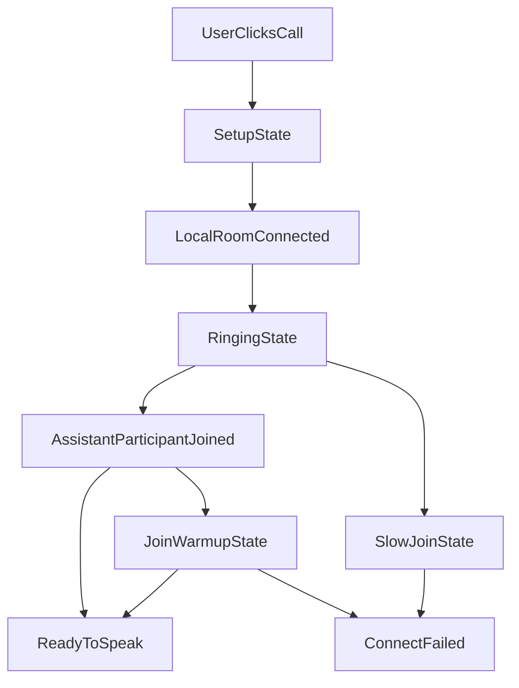

# Task Wake UX Follow-up

This note turns the recent design discussion into concrete product decisions, without changing runtime behavior yet.

It focuses on three questions:

1. What should an ideal **wake packet** look like for scheduled and triggered tasks?
2. What would a convincing **semantic + voice evaluation plan** look like before we change implementation?
3. What should the console's **fake ring / connect policy** be for LiveKit-backed assistant calls?

This is intentionally written in plain English. The goal is to make the design intent obvious before any more code is added.

## Current Constraints

Before deciding anything, it helps to state the current shape of the system:

- Unity task writes are currently **synchronously coupled** to activation projection and scheduled materialization. That means task-related writes can afford some extra orchestration cost, but we should still avoid bloating the wake contract or adding more synchronous work to the hot path.
- The voice wake path can already inject **silent context** into the fast brain before its first meaningful response, but the lookup path is not free. We should assume the packet must stay compact and high-signal.
- The console's ring behavior is **frontend-owned**. LiveKit is responsible for the media session, but the "phone call" feeling is created by the console state machine, not by a LiveKit default.

## 1. Ideal Wake Packet Design

### Design Principles

The wake packet should follow five rules:

1. **One canonical machine envelope, two rendered handoffs.**
   The system should have one authoritative internal packet, then render that differently for the slow brain and fast brain.
2. **Compact but meaningful.**
   The packet should carry enough information to feel human-aware, but not duplicate the entire task row or full prompt.
3. **Authoritative, idempotent, and stale-safe.**
   It must carry the fields needed to reject superseded work and collapse retries.
4. **No fake user events.**
   Scheduled wakes should not pretend the user said something. Triggered wakes should annotate the real inbound, not replace it.
5. **Fast brain and slow brain should not receive the same wording.**
   The fast brain needs a short, pre-answer-safe summary. The slow brain needs a richer execution and judgement frame.

### What Should Stay Canonical in the Machine Envelope

These fields should exist in the authoritative internal packet regardless of whether the wake is scheduled or triggered:

| Field | Why it exists |
| --- | --- |
| `wake_kind` | Distinguishes scheduled due vs triggered candidate set |
| `assistant_id` | Scopes the wake to one assistant |
| `task_id` or candidate task ids | Stable logical task identity |
| `source_task_log_id` | Ties the wake to the source row/version |
| `activation_revision` | Rejects stale or superseded wakes |
| `execution_mode` | Prevents offline work from leaking into live wakes |
| `delivery_id` or `run_key` | Gives retries one shared identity |
| `task_label` | Human-readable short title |
| `task_summary` | One short line explaining what the task is for |
| `visibility_policy` | Makes "silent by default" explicit instead of implied |

The canonical packet should be short enough that it can travel through the wake path cheaply, but rich enough that the assistant does not wake to a cold `task_id` plus a timestamp.

### Ideal Scheduled Wake Packet

#### Canonical meaning

A scheduled wake packet should mean:

> "This specific task became due now. It is still current. This wake belongs to exactly this activation revision. This is the intended lane. This is the short human meaning of the task. The default behavior is silent unless blocked."

#### Recommended contents

| Content | Include? | Why |
| --- | --- | --- |
| `wake_kind = scheduled_due` | Yes | Makes the reason explicit |
| `task_id`, `source_task_log_id`, `activation_revision` | Yes | Required for staleness and idempotency |
| `scheduled_for` | Yes | Confirms timing and helps with catch-up logic |
| `task_label` | Yes | Avoids the cold "task 101" UX |
| `task_summary` | Yes | Gives immediate human intent without loading a whole description |
| `recurrence_hint` | Yes | Lets the assistant know whether this is one-off, recurring, or catch-up sensitive |
| `visibility_policy = silent_by_default` | Yes | Makes the product contract explicit |
| Full task description | No, not in the packet | Too heavy; should be loaded from durable state if needed |
| Tool-by-tool plan | No | Belongs to task execution, not wake-up |

#### Example canonical packet shape

```json
{
  "wake_kind": "scheduled_due",
  "assistant_id": "asst_123",
  "delivery": {
    "delivery_id": "sched_2026-04-14T15:00:00Z_task_42",
    "visibility_policy": "silent_by_default"
  },
  "task": {
    "id": "task_42",
    "source_task_log_id": "log_abc",
    "activation_revision": "rev_9f3c",
    "execution_mode": "live",
    "label": "Send weekly client recap",
    "summary": "Prepare and send the Monday client update based on current project status."
  },
  "due": {
    "scheduled_for": "2026-04-14T15:00:00Z",
    "recurrence_hint": "recurring"
  }
}
```

#### Ideal slow-brain handoff

The slow brain should receive a richer execution frame than it does today. It should know:

- which task is due
- what the task is for in one plain-English line
- whether silence is the default
- whether this is recurring
- that the wake is valid and current
- what action the assistant is expected to take next

An ideal slow-brain version would read like:

> "Scheduled task due now: 'Send weekly client recap.'
> Summary: prepare and send the Monday client update based on the latest project status.
> Due time: 2026-04-14 15:00 UTC.
> This wake is current for activation revision `abc123`.
> Default behavior: work silently unless you need the boss.
> Next step: inspect task details and either execute now, stage briefly, or ask only if genuinely blocked."

That is still concise, but much more human-legible than a bare task id plus due time.

An explicit slow-brain rendering could look like:

```json
{
  "audience": "slow_brain",
  "type": "task_wake_context",
  "wake_kind": "scheduled_due",
  "task_label": "Send weekly client recap",
  "task_summary": "Prepare and send the Monday client update based on current project status.",
  "scheduled_for": "2026-04-14T15:00:00Z",
  "recurrence_hint": "recurring",
  "visibility_policy": "silent_by_default",
  "activation_revision": "rev_9f3c",
  "next_step": "Inspect the task and decide whether to execute now, stage briefly, or ask only if blocked."
}
```

#### Ideal fast-brain handoff

The fast brain should get a shorter, pre-answer-safe version:

> "Background context: the scheduled task 'Send weekly client recap' is due now. Default is silent action; the slow brain is deciding whether it needs the user."

The fast brain version should:

- use the task label
- avoid internal jargon like "notification bar"
- avoid implementation terms like "activation revision"
- avoid sounding like it is being told to speak immediately

An explicit fast-brain rendering could look like:

```json
{
  "audience": "fast_brain",
  "type": "pre_answer_context",
  "wake_kind": "scheduled_due",
  "summary": "The scheduled task 'Send weekly client recap' is due now. Default is silent action unless the user is needed.",
  "speak_policy": "do_not_speak_unless_natural"
}
```

### Ideal Triggered Wake Packet

Triggered wakes are different. The real inbound remains the source of truth. The internal packet should be an **annotation on top of the inbound**, not a synthetic replacement for it.

#### Canonical meaning

A triggered wake packet should mean:

> "This real inbound event mechanically narrowed to these candidate tasks. Semantic judgement is still pending. Here is the short human meaning of each candidate. Here is why they survived narrowing. Do not treat this as a final trigger decision yet."

#### Recommended contents

| Content | Include? | Why |
| --- | --- | --- |
| `wake_kind = triggered_candidates` | Yes | Separates "possible trigger" from "scheduled due" |
| Inbound anchor (`medium`, `contact_id`, message/call id, thread id) | Yes | Keeps the real inbound as source of truth |
| Candidate task ids + `activation_revision`s | Yes | Supports validation and idempotency |
| Candidate labels | Yes | Lets the brains reason in human terms |
| One-line candidate summaries | Yes | Allows semantic judgement without another lookup in the simple case |
| Match rationale | Yes, but short | Example: "SMS from Alice matched contact filter" |
| `judgement_state = pending_semantic_match` | Yes | Makes it clear this is not yet a final decision |
| Offline candidates in live surface | No | Offline work should stay invisible in the live assistant path |
| Full trigger rule schema | No | Too verbose for wake time |

#### Example canonical packet shape

```json
{
  "wake_kind": "triggered_candidates",
  "assistant_id": "asst_123",
  "delivery": {
    "delivery_id": "evt_sms_8891",
    "visibility_policy": "context_only"
  },
  "inbound": {
    "medium": "sms",
    "event_id": "evt_sms_8891",
    "thread_id": "thread_55",
    "contact_id": "contact_alice"
  },
  "judgement_state": "pending_semantic_match",
  "candidates": [
    {
      "task_id": "task_77",
      "activation_revision": "rev_12ab",
      "label": "Invoice follow-up",
      "summary": "Help handle invoice-related requests from Alice.",
      "match_rationale": "Sender and medium matched the trigger rule."
    },
    {
      "task_id": "task_88",
      "activation_revision": "rev_44cd",
      "label": "VIP escalation",
      "summary": "Prioritize urgent requests from Alice.",
      "match_rationale": "Sender matched the VIP contact rule."
    }
  ]
}
```

#### Ideal slow-brain handoff

The slow brain version should say:

> "This inbound SMS from Alice mechanically matched two live trigger candidates.
> Candidate A: 'Invoice follow-up' — help handle invoice-related requests from Alice.
> Candidate B: 'VIP escalation' — prioritize urgent requests from Alice.
> Why they matched: sender and medium fit both rules.
> Semantic judgement is still pending. Decide whether either task truly applies to this inbound, then execute the right task if warranted."

The key difference from today is that the slow brain should not have to infer meaning from task ids alone.

An explicit slow-brain rendering could look like:

```json
{
  "audience": "slow_brain",
  "type": "trigger_candidate_context",
  "wake_kind": "triggered_candidates",
  "inbound_anchor": "Inbound SMS from Alice",
  "judgement_state": "pending_semantic_match",
  "candidates": [
    {
      "label": "Invoice follow-up",
      "summary": "Help handle invoice-related requests from Alice."
    },
    {
      "label": "VIP escalation",
      "summary": "Prioritize urgent requests from Alice."
    }
  ],
  "next_step": "Decide whether any candidate truly applies to the inbound before executing."
}
```

#### Ideal fast-brain handoff

The fast brain should get a shorter version:

> "Background context: this call may relate to the task 'Invoice follow-up' because the caller matches Alice's trigger rule. Do not mention the task unless the conversation naturally requires it; the slow brain is deciding."

The fast brain version should be:

- shorter than the slow-brain version
- phrased as situational awareness, not instruction spam
- safe before first speech

An explicit fast-brain rendering could look like:

```json
{
  "audience": "fast_brain",
  "type": "pre_answer_context",
  "wake_kind": "triggered_candidates",
  "summary": "This caller may relate to the task 'Invoice follow-up'. The slow brain is still deciding whether the trigger truly applies.",
  "speak_policy": "do_not_mention_task_unless_natural"
}
```

### What the Wake Packet Should Avoid

Both wake packet types should avoid:

- giant task descriptions
- raw schema dumps
- fake user messages
- final decisions baked into triggered packets
- visible references to internal architecture ("the notification system", "activation projector")
- language that sounds like a cron reminder rather than colleague context

## 2. Evaluation Plan for the "Virtual Colleague" UX

The current tests prove the plumbing well. The next evaluation layer should prove the **behavior**.

### What We Need to Prove

We should evaluate the feature across these dimensions:

| Dimension | What good looks like |
| --- | --- |
| Situational awareness | The assistant clearly understands why it woke up |
| Restraint | Scheduled starts remain quiet unless blocked |
| Trigger precision | Clear matches activate; near-misses do not |
| Dual-reality blending | The assistant can handle a live request and a trigger candidate naturally at the same time |
| Voice first-turn quality | The first audible turn is context-aware, not cold or contradictory |
| Offline invisibility | Offline tasks do not leak into visible assistant behavior |
| Recurrence sanity | Recurring tasks move forward sensibly after a run, miss, or catch-up |
| Safety and trust | Stale or duplicate wakes do not cause wrong execution |

### Evaluation Layers

We should not try to prove everything in one test type.

#### Layer 1: Contract / plumbing checks

These are mostly automated and close to what already exists.

They should prove:

- activation projection correctness
- scheduled materialization correctness
- stale wake rejection
- warm vs cold wake behavior
- offline tasks staying out of the live lane
- retries / idempotency anchors once those are implemented

This layer tells us the machine pipeline is correct.

#### Layer 2: Semantic transcript evaluations

These should answer:

- Did the assistant pick the right task?
- Did it judge a trigger conservatively?
- Did it act like a colleague rather than an automation script?

These should use realistic task descriptions and inbound content, not toy phrases.

#### Layer 3: Voice evaluations

These should answer:

- Did the fast brain sound context-aware on the first spoken turn?
- Was there too much dead air?
- Did the assistant avoid blurting internal machine phrasing?
- Did scheduled and triggered voice wakes feel natural?

### Recommended P0 Scenario Matrix

These are the scenarios that should count as the first convincing product proof.

| Priority | Scenario | What should be proven | Best evidence |
| --- | --- | --- | --- |
| P0 | Scheduled due while asleep | Assistant wakes quietly, understands the task, and does not proactively spam | Staging trace + transcript + human review |
| P0 | Scheduled due while already running | Assistant incorporates the due task without derailing current work | Transcript + human review |
| P0 | Triggered inbound with one clear live match | Assistant recognizes the right candidate and acts naturally | Transcript + semantic rubric |
| P0 | Triggered inbound with one live request and one trigger implication | Assistant blends both realities naturally | Transcript + semantic rubric |
| P0 | Offline scheduled task | Runtime stays asleep and nothing visible leaks into live UX | Automated negative checks |
| P0 | Voice inbound with a clear trigger | First audible response is context-aware without exposing internals | Voice clip + transcript + human review |
| P0 | Voice scheduled wake on active session | Fast brain is not cold and does not say something contradictory | Voice clip + transcript |

### Recommended P1 Scenarios

| Priority | Scenario | Why it matters |
| --- | --- | --- |
| P1 | Near-miss trigger | Proves conservative trigger judgement |
| P1 | Multiple live trigger candidates | Proves task disambiguation and prioritization |
| P1 | Scheduled work while assistant is busy | Proves adaptive task staging instead of brittle rules |
| P1 | Recurring task after a missed slot | Proves calendar sanity and catch-up judgement |
| P1 | Offline trigger during live conversation | Proves offline invisibility under pressure |

### What Should Be Automated vs Manual

#### Automate

Automate anything that is a hard invariant:

- no wake for offline scheduled tasks in the live runtime
- no stale activation accepted
- no offline candidate surfaced in live trigger notifications
- no duplicate run creation once run keys are fully wired
- warm vs cold wake routing
- correct trigger candidate narrowing

#### Manual or semi-automated

Use human review or rubric-based transcript review for:

- whether the assistant felt like a virtual colleague
- whether the trigger judgement sounded reasonable
- whether the assistant asked the user only when it truly needed input
- whether voice responses felt natural rather than system-driven

### What Evidence Counts as Convincing

Convincing proof should include all of the following:

1. **Automated invariant checks**
   These prove the pipeline is mechanically correct.
2. **Redacted staging traces**
   These show the real system moved through the intended path.
3. **Realistic transcripts**
   These show the assistant behaved properly in context.
4. **Short voice clips**
   These show the first spoken turn was natural.
5. **A small human-rated rubric pass**
   This gives an honest product check on the "virtual colleague" feel.

### Suggested Human Review Rubric

Each transcript or voice clip should be judged against the same simple rubric:

| Dimension | Pass condition |
| --- | --- |
| Wake awareness | The assistant clearly shows it knows why it woke up |
| Decision quality | It picks the right task, or correctly declines a weak trigger |
| Restraint | It does not interrupt or proactively message the user without good reason |
| Naturalness | It sounds like a colleague handling context, not a bot repeating internal instructions |
| Voice readiness | The first spoken turn is not cold, confused, or contradictory |
| Boundary handling | It does not expose offline work or internal machine jargon |

If a scenario only passes plumbing but fails this rubric, it should not count as product-complete.

### Current Biggest Proof Gaps

As of now, the biggest remaining proof gaps are:

- semantic correctness of trigger judgement in realistic ambiguous scenarios
- first spoken turn quality for voice wakes
- whether the fast brain on a weaker model feels fully context-aware
- realistic proof for recurring behavior after actual execution, not just projection
- proof that offline work remains invisible after the full offline lane is fully active

## 3. Console Ring / Connect Policy

### What the Console Does Today

The current console behavior in `useAssistantCall.ts` is:

- starts ring audio immediately when `connect()` begins
- retries connection setup with exponential backoff
- sets a soft slow-join message after 90 seconds
- keeps ringing until:
  - the assistant is already present
  - `ready_to_speak` arrives
  - or 10 seconds after `ParticipantConnected`
- has no hard stop if the assistant never joins
- uses a 30-second rejoin timeout if the assistant drops mid-call
- does not surface the same ring-state controls consistently across the different call views

In short: it has reasonable building blocks, but the state machine is too loose and the ring can last far too long.

### What This Means in Product Terms

The fake ring is not the actual media problem. It is a **UI affordance** that tells the user "your call is being placed."

Because it is fake, it should obey product timing, not infrastructure timing.

That means:

- it should not ring forever
- it should not keep ringing after the assistant has effectively joined
- it should not hide "setup is still happening" behind a phone sound forever
- it should feel intentional and phone-like

### Recommended Call State Model



### Recommended User-Visible States

#### 1. Setup state

**Meaning:** the console is still doing local setup and dispatch work.
**User copy:** "Setting up the call..."
**Audio:** no ring yet
**Recommended duration budget:** 0-5 seconds

Rationale: we should not pretend the assistant is already "ringing" if we are still connecting the user and dispatching the assistant.

#### 2. Ringing state

**Meaning:** local setup is complete and we are waiting for the assistant participant to join.
**User copy:** "Calling {assistantName}..."
**Audio:** ring tone on
**Recommended duration budget:** up to 20 seconds

Rationale: this is the window where a fake phone-call feel is helpful. Beyond that, it stops feeling like ringing and starts feeling broken.

#### 3. Join warmup state

**Meaning:** the assistant participant has connected, but the agent has not yet declared `ready_to_speak`.
**User copy:** "{assistantName} is joining..." or "Connecting audio..."
**Audio:** ring tone off
**Recommended duration budget:** up to 5 seconds after participant join

Rationale: once the participant is present, the user should not still hear a fake outgoing ring.

#### 4. Slow join state

**Meaning:** the assistant has not joined within the normal ring window.
**User copy:** "{assistantName} is taking longer than usual. You can keep waiting, retry, or hang up."
**Audio:** ring tone off
**Recommended start time:** after 20 seconds of ringing

Rationale: this preserves patience without punishing the user with endless ring audio.

#### 5. Failure state

**Meaning:** the assistant did not become ready within a reasonable total budget.
**User copy:** "The call could not connect. Please try again."
**Audio:** ring tone off, optional hangup sound
**Recommended hard timeout:** 30 seconds total from call start if no assistant participant ever joins, or 10 seconds from participant join if `ready_to_speak` still does not arrive

Rationale: we need a real end state. The current "90-second warning and maybe forever ringing" is too generous for a synchronous call UX.

### Recommended Stop Conditions for Ring Audio

The ring tone should stop on the earliest of:

1. assistant participant joined
2. explicit `ready_to_speak`
3. user hang-up
4. transition into slow-join state
5. hard connection failure

The ring tone should **not** continue for 10 seconds after `ParticipantConnected`. That period should be a silent warmup state instead.

### Recommended Timers

| Timer | Recommendation | Why |
| --- | --- | --- |
| Setup budget | 5 seconds | Enough for room/token/dispatch without pretending to ring yet |
| Ring budget | 20 seconds | Feels like a real outbound call, but not endless |
| Participant-joined warmup | 5 seconds | Gives `ready_to_speak` a small grace period without fake ringing |
| Hard first-join timeout | 30 seconds total | Reasonable upper bound for a user-initiated call |
| Mid-call rejoin timeout | keep 30 seconds for now | Current behavior is already defensible for recovery |

### Pop-out / Fullscreen Recommendation

The fullscreen or pop-out experience should follow the **same state machine**, even if the team chooses not to play audible ring audio there.

The important thing is not identical sound. It is identical **meaning**:

- same setup state
- same ringing or waiting state
- same slow-join transition
- same failure threshold

Today the pop-out flow is semantically similar but behaviorally inconsistent. That inconsistency is likely to confuse debugging and user perception.

### What LiveKit Should and Should Not Decide Here

For the current room-based console call flow:

- LiveKit decides media connectivity and participant events.
- The console decides what counts as "ringing."

This is important because LiveKit telephony docs and SIP-specific ringing timeouts are not the right defaults for this UI. Our console is creating a fake phone-call feel on top of a room join, so the product should own the ring policy directly.

The most relevant LiveKit-style timing guidance for this path is not "how long should a SIP phone ring?" but "how long does it feel acceptable to wait for an agent to connect before the UI should change state?"

For that reason, the recommended policy above is a product choice, not a transport default.

## Recommended Next Steps

If we implement these decisions later, the order should be:

1. enrich the internal wake contract and rendered slow/fast handoffs
2. add semantic transcript and voice evaluation coverage for P0 scenarios
3. tighten the console ring state machine and unify its in-app vs fullscreen behavior

That order gives the product a clearer wake reason first, then proves it behaves correctly, then smooths the last-mile call UX around it.
